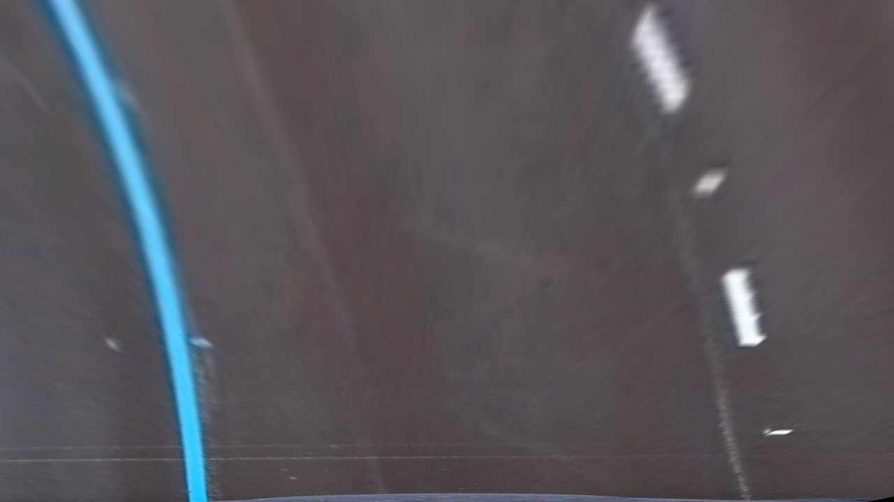
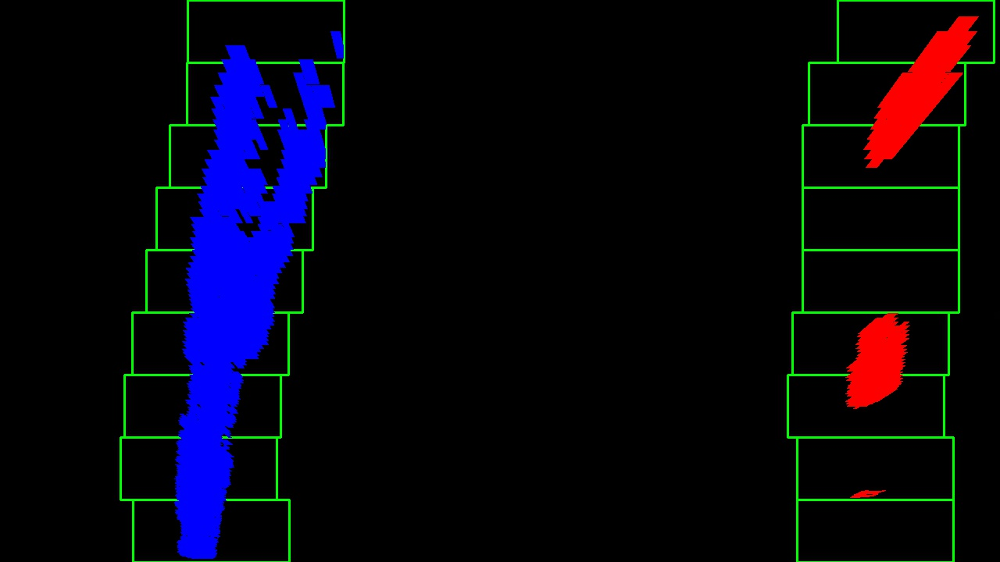

## Writeup 

### Camera Calibration

#### 1. Briefly state how you computed the camera matrix and distortion coefficients. Provide an example of a distortion corrected calibration image.

For performing the camera calibration, I create a new function called cal_undistirt. In this function I first obtain the ret,dist, mtx. Then I use the mtx and dist to perform undistortion using cv2.undistort.

I then import all the chess board images. I create empty arrays for object points and image points. The object points are prepared based on the sizeofthe chessboard, in this case it is 9X6. I then import all thechessboard images, convert them to gray scale. I then find the cornersof the chessboard using cv2.findchessboardcorners. I then run the imagethrough the defined function cal_undistort which undistorts the image as well.

### Pipeline (single images)

#### 1. Provide an example of a distortion-corrected image.

I then passed all the test images thorugh cal_undistort function which undistorts the image as well

#### 2. Describe how (and identify where in your code) you used color transforms, gradients or other methods to create a thresholded binary image.  Provide an example of a binary image result.

I then created the following functions which we have discussed in the class and use a combination of the following functions to create a threshold binary image:

func abs_sobel_thresh: abs_sobel_thresh can perform Sobel function in either x or y direction. It takes an input of minimum threshold and maximum threshold to perform directional thresholding.

func mag_thresh:This function takes image, a sobel_kernel value and magnitude threshold (min and max) as input. We take the sobel in both the x and y direction, we then calculate the magnitude by calculating the square root of the addition the squares in x and y direction. We then scale it to 8 bit andconvert it to type uint8. We then use the minimum and maximum threshold to create a binary image output.

func dir_threshold: Similar to the mag threshold, this function calculates the direction of the sobel by using the np.arctan2 function on sobelx and sobel y. And again create a binary image finally using the minimum and maximum threshold values.

To create a final threshold binary image we first convert the image to a hls color spectrum. Then we only consider the image in S channel as that helps the most to identify the lane lines.  

   I then perform pass the test image through the sobel function in x and y direction, magnitude and binary as well. Finally I combine all the gradx, grad y, magnitude and binary image and call it g_mask. I then use the S channel image in conjuntion with the g_mask with minimum and maximum threshold. This gives us the final binary image.
   
   I combine all the above functions into a bigger function called findedges

#### 3. Describe how (and identify where in your code) you performed a perspective transform and provide an example of a transformed image.

The code for my perspective transform is called corners_unwarp. The source points I have chosen are as follows:     
     [280,  700]
     [595,  460],  
     [715,  460],  
     [1105, 700]

The destination points are:
     [250,  720], 
     [250,    0], 
     [1065,   0],  
     [1065, 720]

The offset is set to 80 and the nx is set to 9
I then verify that the above values work by plotting the perspective transforms.

#### 4. Describe how (and identify where in your code) you identified lane-line pixels and fit their positions with a polynomial?

I then take the histogram of the bottom half final perspective transformed image. From this histogram we can identify the peaks and estimate where the lane lines are in the image. We then take the mid point of the histogram and then calculate the lesft base and the right base. From these base position we create a sliding window using the hyper parameters defined and iterate them across the binary activations in the image. These left and right pixel positions of the lanes are stored in left_lane_inds and right_lane_inds. I then fit a 2nd order polynomial using these lane indices and then plot this polynomial to get a better understanding visually. I seperate these into two functions i.e., find_lane_pixels and fit_polynomial within which I call find_lane_pixels.

 

#### 5. Describe how (and identify where in your code) you calculated the radius of curvature of the lane and the position of the vehicle with respect to center.

I created the function measure_curvature_pixel similar as described in the class by using the radius of a curve formula. I however had some issues calculating the radius in meters.

#### 6. Provide an example image of your result plotted back down onto the road such that the lane area is identified clearly.

I then use the points detected on the left and right to draw a lane line and create a weighted image with the original image and the drawn polynomial.

---

### Pipeline (video)

#### 1. Provide a link to your final video output.  Your pipeline should perform reasonably well on the entire project video (wobbly lines are ok but no catastrophic failures that would cause the car to drive off the road!).

Here's a [link to my video result](./project_video_output.mp4)

---

### Discussion

#### 1. Briefly discuss any problems / issues you faced in your implementation of this project.  Where will your pipeline likely fail?  What could you do to make it more robust?

I had a couple of issues while creating this pipeline. There was definetely a lot of calculation happening and it took me quite a while to figure out good threshold values and be able to fit a polynomial. If the perspective transform is messed up in certain images, the polynomial does not fit correctly. I think this is something to work on.

Additionally I had issues in calculating the radius of curvature in meters and was unsuccessful. 

Apart from that, I had certain frames in the videos where there were no left and right lanes detected correctly. I think the better approach was to save the previous lane information but I had to skip on some improvements due to time constraint.
